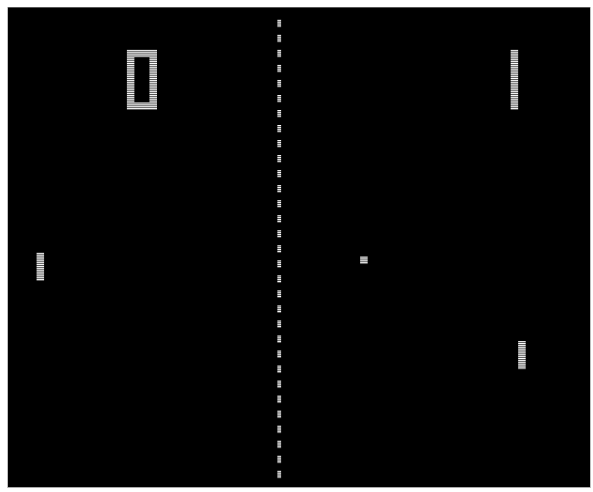
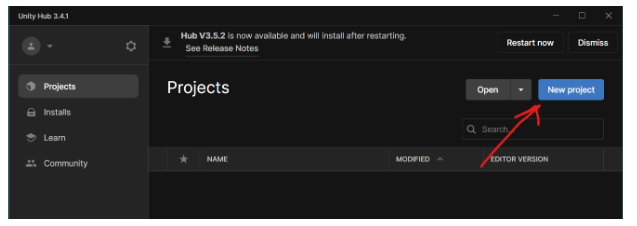
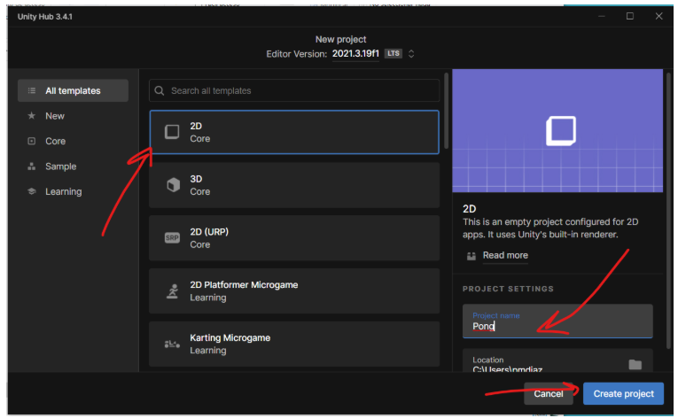
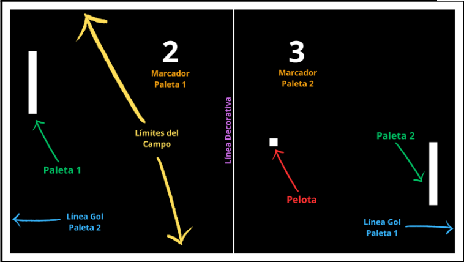
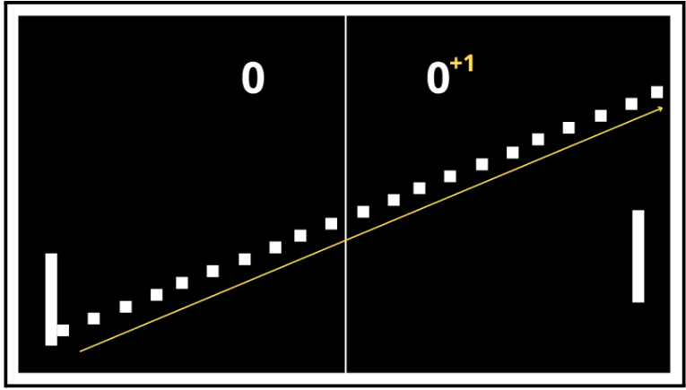
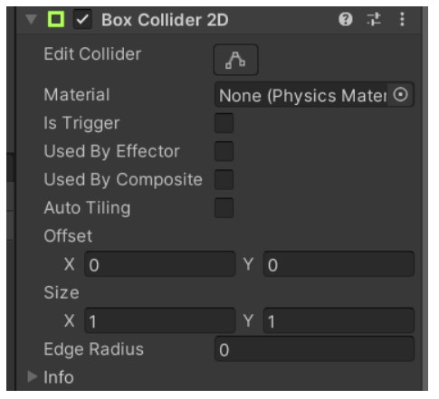
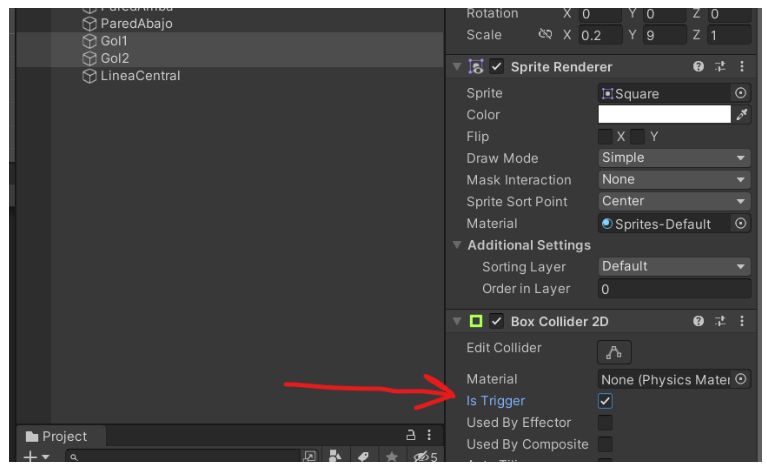
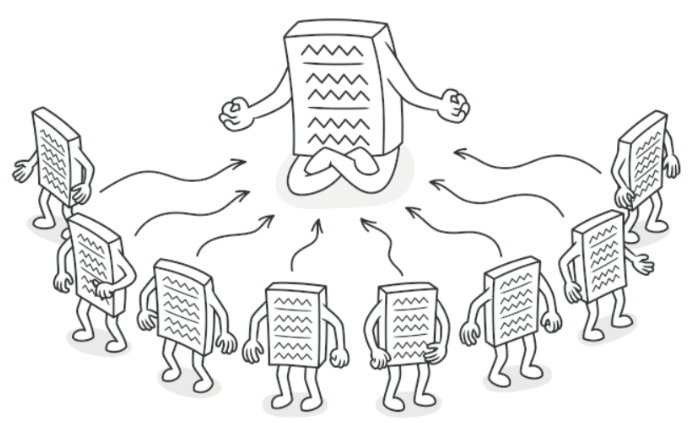

# ​🏓​ Proyecto PONG en Unity 🎾

## 1. Qué es el PONG

- Pong (o Tele-Pong) fue un videojuego de la primera generación de videoconsolas publicado por Atari, creado por Nolan Bushnell y lanzado el 29 de noviembre de 1972.
- La palabra Pong es una marca registrada por Atari Interactive, mientras que la palabra genérica «pong» es usada para describir el género de videojuegos «bate y bola».
- La popularidad de Pong dio lugar a una demanda de infracción de patentes y ganada por parte de los fabricantes de Magnavox Odyssey, que poseía un juego similar en el que Pong de Atari claramente se había inspirado luego de una visita de Bushnell a las oficinas de Magnavox donde vio una demostración del mismo.

<p align="center">
    
</p>

---

## 2. Cómo crear un proyecto 2D

Para empezar a crear nuestro juego vamos a crear un proyecto 2D. Hacemos clic en **New project** en Unity Hub.

<p align="center">
    
</p>

Elegimos **2D Core**, ponemos el nombre del proyecto y hacemos clic en **Create project**.

<p align="center">
    
</p>

### 2.1 Configuración inicial del proyecto

1. Seleccionamos la cámara (**Main Camera**) y en el **Inspector** a la derecha seleccionamos **Background** (color de fondo). Indicamos que sea **negro**.
2. Mostramos la ventana del juego y la desplazamos al panel inferior.
3. Configuramos un tamaño de **16:9**.

---

## 3. Análisis del Juego

### 3.1 Elementos del Juego

Para poder realizar un juego estilo PONG necesitamos los siguientes elementos.

<p align="center">
    
</p>

### 3.2 Dinámica del Juego

- Los jugadores se pasan la pelota entre sí.
- Si la pelota toca la pared superior o inferior rebota y se sigue jugando.
- Un jugador hace punto si la pelota cruza la línea que defiende el otro jugador.
- Cuando se anota un punto se incrementa el marcador del jugador.

<p align="center">
    
</p>

---

## 4. Gráficos del Juego

### 4.1 Creamos la bola y las palas

- Creamos la bola desde **Hierarchy > 2D Objects > Sprites > Square**
- Nombre: **Bola**
- Escala: **0.3 en X y Y**

Para las palas:

- Duplicamos la bola y la llamamos **Pala1**
- Posición en **X=7.5**, escala **Y=1.5**
- Duplicamos y renombramos a **Pala2** con **X=-7.5**.

### 4.2 Creamos las 4 paredes del juego

- Duplicamos la bola → **ParedArriba**: Y=4.5, Escala X=17, Y=0.2
- Duplicamos → **ParedAbajo**: Y=-4.5
- Duplicamos → **Gol1**: X=8.4, Escala X=0.2, Y=9
- Duplicamos → **Gol2**: X=-8.4

### 4.3 Creamos la línea divisoria

- Duplicamos Gol2 → **LineaCentral**: X=0, Escala X=0.01.

---

## 5. Lógica del Juego

### 5.1 Añadimos los Colisionadores

Agregamos **BoxCollider2D** a todos los Sprites excepto a la **LineaCentral**.

<p align="center">
    
</p>

### 5.2 Indicamos Sprites Gol como “Triggers”

Seleccionamos **Gol1** y **Gol2**, en el Inspector activamos **IsTrigger (true)**.

<p align="center">
    
</p>

### 5.3 Elementos en Movimiento (RigidBody)

- Bola y Palas con **RigidBody 2D**.
- Palas: **BodyType = Kinematic**.
- Bola: **BodyType = Dynamic, GravityScale = 0**.

### 5.4 Física de la Bola

Creamos un **Physics Material 2D** → “Rebote”

- Friction=0
- Bounciness=1

Lo asignamos al RigidBody de la bola.

### 5.5 Script de la Pala

```csharp
public class Pala : MonoBehaviour
{
    [SerializeField] private float velocidad = 7f;

    void Update()
    {
        float movimiento = Input.GetAxisRaw("Vertical");
        transform.position += new Vector3(0,
                               movimiento * velocidad * Time.deltaTime,
                               0);
    }
}
```

### 5.6 Independizar el movimiento de las palas

Creamos dos ejes de entrada: **Vertical** y **Vertical2**.  
Actualizamos el Script:

```csharp
public class Pala : MonoBehaviour
{
    [SerializeField] private float velocidad = 7f;
    [SerializeField] private bool isPala1;

    void Update()
    {
        float movimiento = isPala1 ? Input.GetAxisRaw("Vertical") : Input.GetAxisRaw("Vertical2");
        transform.position += new Vector3(0, movimiento * velocidad * Time.deltaTime, 0);
    }
}
```

### 5.7 Límites de las Palas

```csharp
public class Pala : MonoBehaviour
{
    [SerializeField] private float velocidad = 7f;
    [SerializeField] private bool isPala1;
    private float limiteY = 3.75f;

    void Update()
    {
        float movimiento = isPala1 ? Input.GetAxisRaw("Vertical") : Input.GetAxisRaw("Vertical2");
        Vector2 posicionPala = transform.position;
        posicionPala.y = Mathf.Clamp(posicionPala.y + movimiento * velocidad * Time.deltaTime, -limiteY, limiteY);
        transform.position = posicionPala;
    }
}
```

### 5.8 Movimiento de la Bola

```csharp
public class Bola : MonoBehaviour
{
    [SerializeField] private float velocidadInicial = 4f;
    private Rigidbody2D bolaRb;

    void Start()
    {
        bolaRb = GetComponent<Rigidbody2D>();
        Lanzar();
    }

    private void Lanzar()
    {
        float velocidadX = Random.Range(0, 2) == 0 ? 1 : -1;
        float velocidadY = Random.Range(0, 2) == 0 ? 1 : -1;
        bolaRb.velocity = new Vector2(velocidadX, velocidadY) * velocidadInicial;
    }
}
```

### 5.9 Incrementar velocidad al golpear palas

```csharp
private void OnCollisionEnter2D(Collision2D collision)
{
    if(collision.gameObject.CompareTag("Pala"))
    {
        bolaRb.velocity *= 1.1f;
    }
}
```

### 5.10 Marcadores

Para que sólo tengamos una instancia única del Controlador del Juego vamos a implementar el patrón de diseño “Singleton”. 

<p align="center">
    
</p>

```csharp
using UnityEngine;
using TMPro;

public class ControladorJuego : MonoBehaviour
{
    [SerializeField] private TMP_Text marcadorPala1;
    [SerializeField] private TMP_Text marcadorPala2;
    [SerializeField] private Transform pala1Transform;
    [SerializeField] private Transform pala2Transform;
    [SerializeField] private Transform bolaTransform;

    private int golesPala1, golesPala2;

    private static ControladorJuego instance;
    public static ControladorJuego Instance
    {
        get
        {
            if(instance==null)
            {
                instance = FindObjectOfType<ControladorJuego>();
            }
            return instance;
        }
    }

    public void GolPala1()
    {
        golesPala1++;
        marcadorPala1.text = golesPala1.ToString();
    }

    public void GolPala2()
    {
        golesPala2++;
        marcadorPala2.text = golesPala2.ToString();
    }

    public void Reiniciar()
    {
        pala1Transform.position = new Vector2(pala1Transform.position.x, 0);
        pala2Transform.position = new Vector2(pala2Transform.position.x, 0);
        bolaTransform.position = new Vector2(0, 0);
    }
}
```

En el Script de la Bola:

```csharp
private void OnTriggerEnter2D(Collider2D collision)
{
    if(collision.gameObject.CompareTag("golPala1"))
    {
        ControladorJuego.Instance.GolPala1();
    }
    else
    {
        ControladorJuego.Instance.GolPala2();
    }
    ControladorJuego.Instance.Reiniciar();
    Lanzar();
}
```

---

## Documentación extra

- Unity Docs: [https://docs.unity3d.com/](https://docs.unity3d.com/)
- Patrón Singleton: [https://refactoring.guru/es/design-patterns/singleton](https://refactoring.guru/es/design-patterns/singleton)

---

[](https://github.com/devTever)
